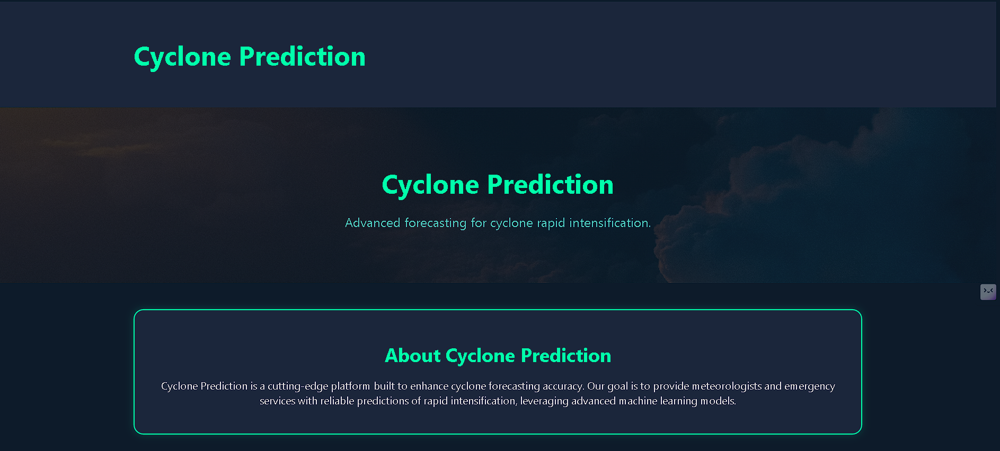
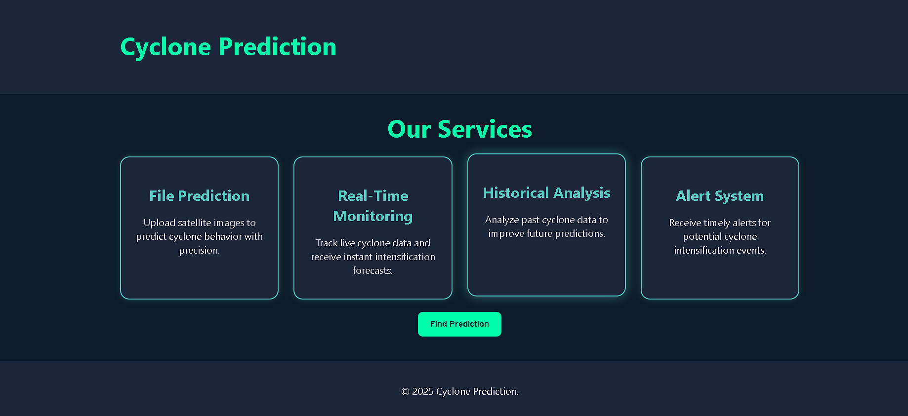
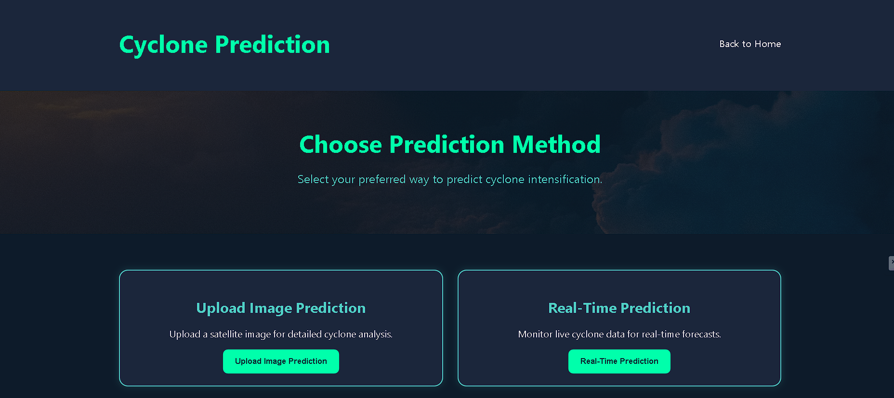
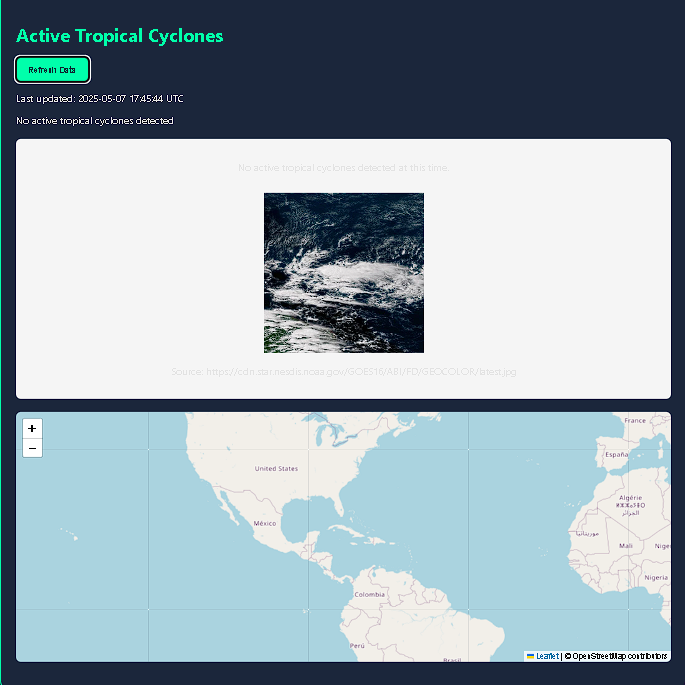
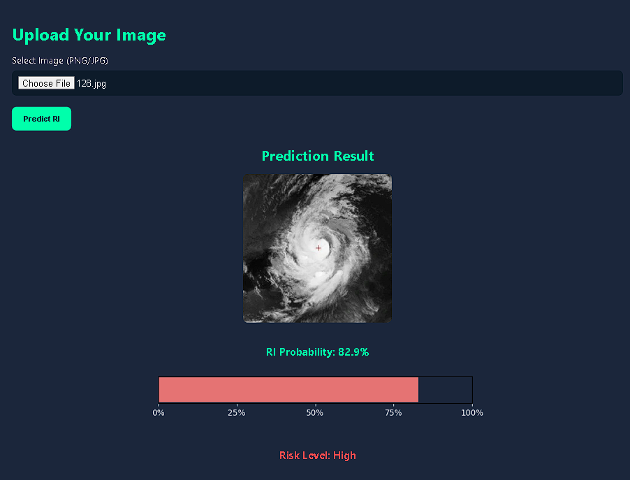

# 🌀 Cyclone Rapid Intensification Prediction using CNN

This project is a **deep learning-powered web application** designed to predict the **Rapid Intensification (RI)** risk of tropical cyclones using satellite imagery and real-time cyclone data. It serves as an early warning tool that assists meteorological agencies, researchers, and developers in analyzing active and potential cyclones in the Indian Ocean region.

---

## 🔍 About the Project

- 🌪️ **Rapid Intensification (RI)** refers to a sudden and sharp increase in a cyclone’s wind speed over a short time, typically 24 hours.
- 🚀 This app uses satellite images and CNN-based machine learning to **predict the probability** of RI for a given cyclone.
- 🌍 It supports both **real-time cyclone analysis** from live feeds and **manual image upload** for custom predictions.

---

## ⚙️ Features

- **CNN-based RI Predictor**: Trained on INSAT-3D satellite imagery.
- **Real-Time Cyclone Monitoring**: Fetches active cyclone data from NOAA, IMD, and JTWC sources.
- **Interactive Risk Gauges**: Displays RI probability with intuitive color-coded gauges.
- **Image Upload Interface**: Upload custom satellite images to get predictions.
- **Geolocation-Aware Prediction**: Adjusts outputs based on cyclone position in the Arabian Sea or Bay of Bengal.
- **Enhanced Satellite Image Preprocessing**: Applies sharpening and region cropping for better feature detection.

---

## 🏠 Home Page

The home page introduces the app and provides access to two key functionalities:
1. **Upload Image Prediction**
2. **Real-Time Prediction**

### 📸 Home Page Preview




---

## 🌍 Real-Time Cyclone Prediction Page

This page displays **live satellite data** and **active cyclone tracks** sourced from agencies like NOAA and IMD. For each active storm:
- Satellite image is marked with its location.
- Probability of RI is computed.
- A risk gauge is generated.

### 💡 How it Works:
- Downloads the latest global cyclone feed.
- Retrieves satellite image centered on cyclone.
- Passes it through a CNN model.
- Adjusts score using latitude/longitude.

### 📸 Real-Time Page Preview


---

## 📤 Upload Image Prediction Page

Users can upload satellite images in `.jpg`, `.png`, or `.webp` format to get an RI prediction.

### Key Features:
- Automatic resizing and preprocessing of the image.
- CNN inference and result formatting.
- Gauge output and confidence level.
- Useful for testing historical cyclone images.

### 📸 Upload Page Preview


---

## 🧠 Model Details

- **Type**: Convolutional Neural Network with attention mechanism
- **Input Shape**: 256x256 RGB images
- **Output**: Single sigmoid neuron for RI probability
- **Training Dataset**: Custom dataset built from INSAT-3D satellite images labeled with rapid intensification flags
- **Enhancements**: Synthetic fallback images, location-weighted scoring, brightness filters

---

## 🚀 Getting Started

### 1. Clone and Install
```bash
git clone https://github.com/yourusername/cyclone_ri_prediction-CNN-.git
cd cyclone_ri_prediction-CNN-
pip install -r requirements.txt
